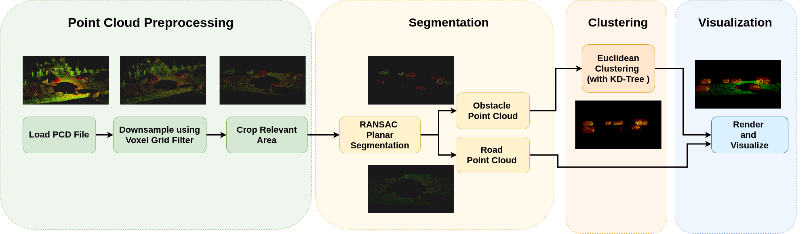

# LIDAR Obstacle Detection

## Description

The goal of this project is to use to various algorithms on Point Cloud data such as Voxel Grid filtering, RANSAC segmentation and Euclidean Clustering with KD-Tree to detect obstacles.

## Pipeline

## Results
The following animation shows the segmented point clouds - obstacles (in yellow) and road (in green)

## Closing thoughts
1. Tracking can used to keep a record of obstacles throughout all the point clouds.
2. 3D Object detection can further aid in determining the type of obstacle (car, traffic signal pole, etc.).
